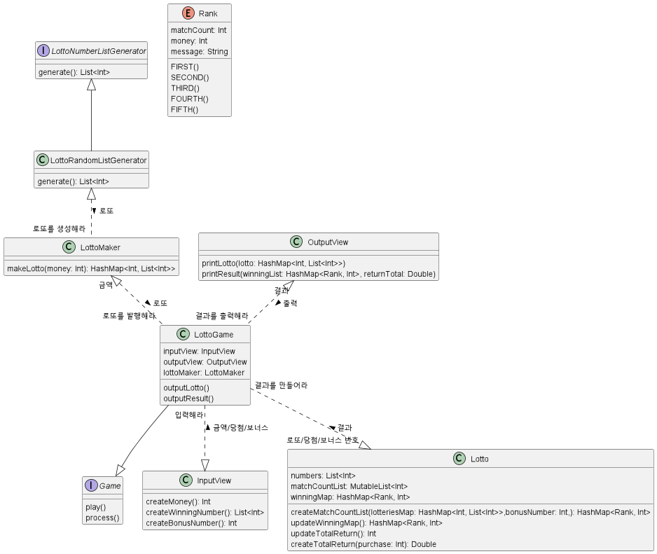

# 클래스 다이어그램

# 관심사의 분리, 단일 책임 원칙

## 기능 목록

1. 로또 구입 금액을 입력 받는 기능
2. 당첨 번호를 입력 받는 기능. (번호는 쉼표(,)를 기준으로 구분)
3. 보너스 번호를 입력 받는 기능.
4. 발행한 로또 수량 및 번호 출력 기능. (로또 번호는 오름차순으로 정렬)
5. 당첨 내역을 출력 기능
6. 수익률은 소수점 둘째 자리에서 반올림 기능. (ex. 100.0%, 51.5%, 1,000,000.0%)
7. 예외 상황 시 에러 문구 출력 기능. (단, 에러 문구는 "[ERROR]"로 시작)
